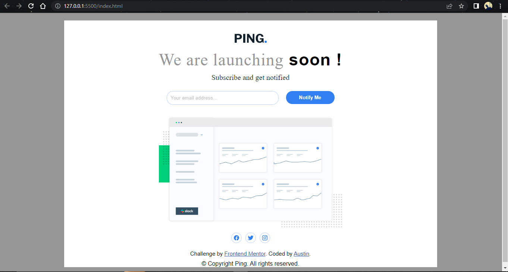
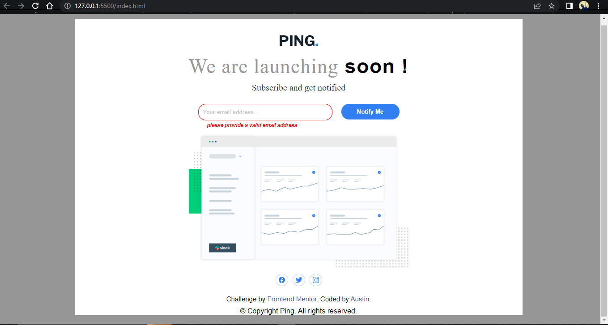

## Overview

This is a solution to the [Ping coming soon page challenge on Frontend Mentor](https://www.frontendmentor.io/challenges/ping-single-column-coming-soon-page-5cadd051fec04111f7b848da). 
Every code was written by me. 

### The challenge

Users should be able to:

- View the optimal layout for the site depending on their device's screen size
- See hover states for all interactive elements on the page
- Submit their email address using an `input` field
- Receive an error message when the `form` is submitted if:
	- The `input` field is empty. The message for this error should say *"Whoops! It looks like you forgot to add your email"*
	- The email address is not formatted correctly (i.e. a correct email address should have this structure: `name@host.tld`). The message for this error should say *"Please provide a valid email address"*

### Screenshot

### Links
- Solution URL: [https://github.com/Ausranking/ping-coming-soon-page.git]

- Live Site URL: [https://ping-coming-soon-page-six-delta.vercel.app/]

## My process

### Built with

- Semantic HTML5 markup
- CSS custom properties
- Flexbox
- Mobile-first workflow

### What I learned

while trying to write nice codes for this challenge, I understood better the use of media querries
to make the page responsive across almost all devices.
Also i tried to improve in the basic form validation using javascript. 

### Continued development

In future projects, I'll like to improve in form validation using javascript 
And also mobile responsiveness of every other project.

### Useful resources

- [Example resource 1](https://www.ion-icons.com) - This helped me to get the social media icons in the project.
- [Example resource 2](https://www.googlefonts.com) - This is an amazing site which helped me get the right font for this challenge. I recommend it to anyone still learning this concept.

## Author

- Frontend Mentor - [@austranking](https://www.frontendmentor.io/profile/austranking)
- Twitter - [@King Austin](https://www.twitter.com/_kingaustinn)

